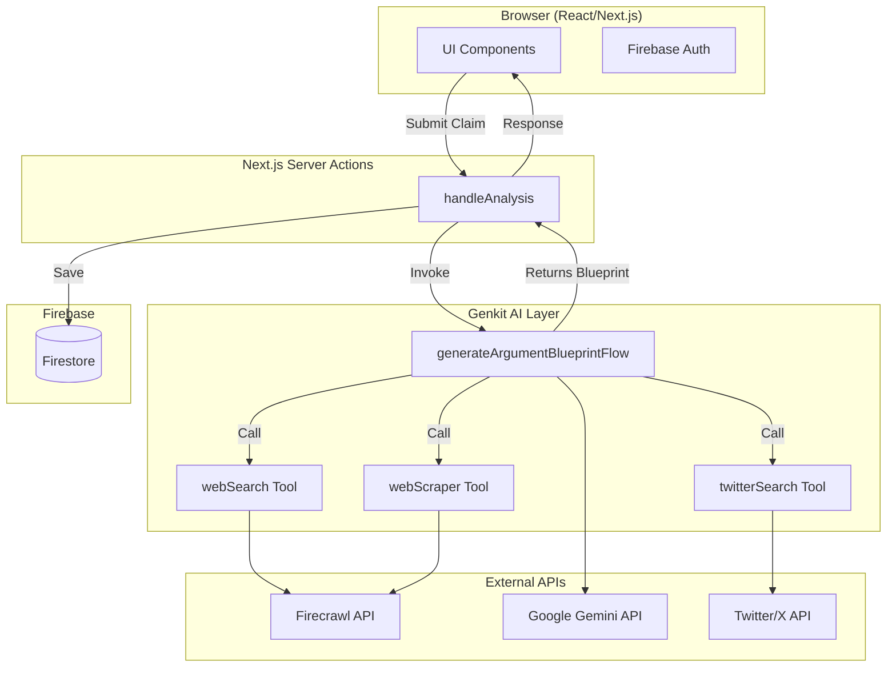

# Argument Atlas - System Architecture & Technical Documentation

## Overview

**Argument Atlas** is a real-time argument analysis and visualization platform that uses AI to dissect claims, gather evidence from the web and social media, and present findings in multiple interactive visualization formats.

---

## Tech Stack

| Layer | Technology | Purpose |
|-------|-----------|---------|
| **Frontend** | Next.js 15 + React 18 | App Router, SSR, Server Actions |
| **Styling** | TailwindCSS 3.4 + Radix UI | Utility-first CSS + Headless components |
| **Animations** | Framer Motion 11 | Physics-based animations (Compass needle, etc.) |
| **State/Forms** | React Hook Form + Zod | Form handling & schema validation |
| **AI Framework** | Genkit 1.20 | AI orchestration, tool definitions, flows |
| **LLM** | Google Gemini 2.5 Flash | Primary model for argument analysis |
| **Web Search** | Firecrawl API | Web search & markdown scraping |
| **Social Data** | Twitter/X API | Social pulse & tweet retrieval |
| **Auth** | Firebase Auth + next-firebase-auth-edge | Client & edge authentication |
| **Database** | Firestore | Storing saved argument maps |
| **Export** | html-to-image | PNG/SVG export of visualizations |

---

## Folder Structure

```
src/
├── ai/                    # AI Layer
│   ├── genkit.ts          # Genkit instance config (model, plugins)
│   ├── flows/             # AI Flows (orchestrated prompts)
│   │   └── generate-argument-blueprint.ts
│   └── tools/             # Genkit Tools (callable by AI)
│       ├── web-search.ts      # Firecrawl search
│       ├── web-scraper.ts     # Firecrawl scraper
│       └── twitter-search.ts  # Twitter API tool
│
├── app/                   # Next.js App Router
│   ├── page.tsx           # Home/Analysis page
│   ├── login/             # Auth pages
│   ├── signup/
│   ├── forgot-password/
│   └── api/               # API routes (if any)
│
├── components/            # React Components
│   ├── analysis/          # Visualization views
│   │   ├── TreeView.tsx
│   │   ├── BalancedView.tsx
│   │   ├── CompassView.tsx
│   │   ├── PillarView.tsx
│   │   ├── CircularView.tsx
│   │   ├── FlowchartView.tsx
│   │   ├── SocialView.tsx
│   │   ├── ArgumentCard.tsx
│   │   └── AnalysisToolbar.tsx
│   └── ui/                # Shadcn/Radix primitives
│
├── firebase/              # Firebase SDK wrappers
│   ├── index.ts           # Client SDK init
│   └── provider.tsx       # AuthProvider context
│
├── lib/                   # Utilities & Types
│   ├── types.ts           # TypeScript interfaces
│   ├── utils.ts           # Helpers (buildTree, cn, etc.)
│   └── actions.ts         # Server Actions
│
└── hooks/                 # Custom React hooks
```

---

## Architecture Diagram



---

## Data Flow

1. **User Input**: User enters a claim/thesis in the UI.
2. **Server Action**: `handleAnalysis` (in `lib/actions.ts`) receives the input.
3. **AI Flow**: `generateArgumentBlueprintFlow` is invoked via Genkit.
4. **Tool Calls**: The LLM calls:
   - `webSearch` → Firecrawl searches trusted news outlets
   - `webScraper` → Firecrawl scrapes full article markdown
   - `twitterSearch` → Fetches relevant tweets
5. **Analysis**: Gemini generates structured output:
   - `blueprint`: Array of `ArgumentNode[]`
   - `summary`, `credibilityScore`, `brutalHonestTake`, `keyPoints`
   - `socialPulse`, `tweets`
6. **Storage**: Result is saved to Firestore (if authenticated).
7. **Visualization**: UI renders the data in multiple view modes.

---

## Key Components

### AI Flow: `generateArgumentBlueprintFlow`
- **Location**: `src/ai/flows/generate-argument-blueprint.ts`
- **Purpose**: Orchestrates the entire analysis pipeline
- **Output Schema** (Zod):
  ```typescript
  {
    thesis: string,
    summary: string,
    credibilityScore: number,
    brutalHonestTake: string,
    keyPoints: string[],
    blueprint: ArgumentNode[],
    socialPulse: string,
    tweets: Tweet[]
  }
  ```

### Visualization Components
| View | Description |
|------|-------------|
| `TreeView` | Hierarchical tree with ArgumentCards |
| `BalancedView` | Side-by-side For/Against columns |
| `CompassView` | Gauge chart with weighted needle |
| `PillarView` | Stacked pillar representation |
| `CircularView` | Radial layout |
| `FlowchartView` | Flowchart-style connections |

---

## Environment Variables

| Variable | Purpose |
|----------|---------|
| `GOOGLE_GENAI_API_KEY` | Gemini API access |
| `FIRECRAWL_API_KEY` | Web search & scraping |
| `TWITTER_BEARER_TOKEN` | Twitter API access |
| `FIREBASE_*` | Firebase project config |
| `FIREBASE_SERVICE_ACCOUNT` | Admin SDK credentials |

---

## Build & Run

```bash
# Development
npm run dev          # Next.js on port 9002 (Turbopack)
npm run genkit:dev   # Genkit dev server

# Production
npm run build
npm run start
```

---

## Security Considerations

- Firebase Auth for user authentication
- Firestore Security Rules for data access control
- Server Actions validate auth tokens before Firestore writes
- API keys are server-side only (not exposed to client)
